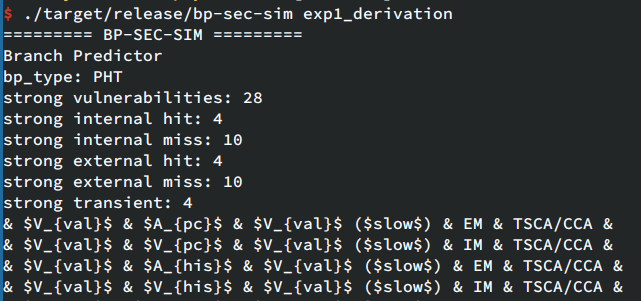
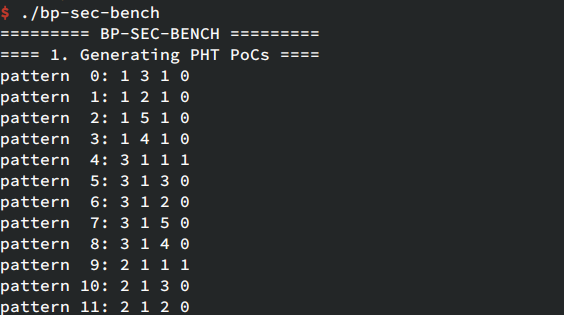

# Branch Predictor Security Evaluation Framework

This framework is a formal modeling and analysis framework for evaluating the vulnerabilities of timing-based and transient execution-based attacks on branch predictors in modern processors.


## PART I: Symbolic Simulator

Research Artifact of HPCA 2024 Paper: *Modeling, Derivation, and Automated Analysis of Branch Predictor Security Vulnerabilities*. This part contains the source code of our symbolic execution-based branch predictor simulator that can be used to automatically derive and analyze branch predictor security vulnerabilities.

[](https://doi.org/10.5281/zenodo.10297402)

<table>
<tbody>
<tr>
<td align="center", width="25%"></td>
<td align="center", width="25%"></td>
<td align="center", width="25%"></td>
<!-- <td align="center", width="25%"></td> -->
<tr>
<td align="center">Available</td>
<td align="center">Reviewed</td>
<td align="center">Reproduced</td>
<!-- <td align="center">Replicated</td> -->
</tbody>
</table>

Prerequisites:

- Rust 2021

### Using Cargo

Build the project:

```bash
$ git clone https://github.com/iamywang/bp-security-framework.git
$ cd bp-sec-sim
$ cargo build --release
```

Run the simulator:

```sh
$ ./target/release/bp-sec-sim exp1_derivation
```

Output:



### Using Docker

A `Dockerfile` is provided for automatic deployment. You can create a Docker container with all necessary dependencies by following these steps:

1. Install Docker: `sudo apt install docker.io`
2. Clone the repository: `git clone https://github.com/iamywang/bp-security-framework.git && cd bp-sec-sim`
3. Build the Docker image: `docker build -t bp-sec-sim .`
4. Run and attach to the Docker container: `docker run -it bp-sec-sim`
5. After you are done, delete the Docker container: `docker ps -a` and `docker rm <CONTAINER_ID>`
6. (Optional) Delete the Docker image: `docker images` and `docker rmi <IMAGE_ID>`

Upon attaching to the container, a `bash` shell will be presented:

```bash
root@f4ebe50229ac:/bp-sec-sim# bp-sec-sim
========= BP-SEC-SIM =========
Usage: ./bp-sec-sim <exp1_derivation|exp2_rsb_refilling|exp2_secure_bp|exp3_baseline_bp|exp3_secure_bp|exp3_hw_defenses|exp4_tage>
Example: ./bp-sec-sim exp1_derivation
========== LICENSE ===========
Copyright 2023 iamywang

Licensed under the Apache License, Version 2.0 (the "License");
you may not use this file except in compliance with the License.
You may obtain a copy of the License at

    http://www.apache.org/licenses/LICENSE-2.0

Unless required by applicable law or agreed to in writing, software
distributed under the License is distributed on an "AS IS" BASIS,
WITHOUT WARRANTIES OR CONDITIONS OF ANY KIND, either express or implied.
See the License for the specific language governing permissions and
limitations under the License.
==============================
```

## PART II: Security Benchmark

This part is used to automatically generate a security benchmark for attacks derived from the branch predictor security analysis framework proposed in *Modeling, Derivation, and Automated Analysis of Branch Predictor Security Vulnerabilities* (HPCA 2024).

Prerequisites:

- CMake >= 3.10
- gcc >= 7.5
- python >= 3.6 (with numpy installed)

Build the project:

```bash
$ git clone https://github.com/iamywang/bp-security-framework.git
$ cd bp-security-framework
$ cd bp-sec-bench
$ mkdir build && cd build
$ cmake ..
$ make
```

Generate the benchmark:

```sh
$ ./build/bp-sec-bench
```

Output:



## Copyright and License

This project is licensed under the terms of the Apache License 2.0.

```
Copyright 2023 iamywang

Licensed under the Apache License, Version 2.0 (the "License");
you may not use this file except in compliance with the License.
You may obtain a copy of the License at

    http://www.apache.org/licenses/LICENSE-2.0

Unless required by applicable law or agreed to in writing, software
distributed under the License is distributed on an "AS IS" BASIS,
WITHOUT WARRANTIES OR CONDITIONS OF ANY KIND, either express or implied.
See the License for the specific language governing permissions and
limitations under the License.
```

We would like to thank the authors of the following projects for their useful tools:

- [IAIK/transientfail](https://github.com/IAIK/transientfail)
- [fanyao/branchspec](https://github.com/fanyao/branchspec)
- [vusec/bhi-spectre-bhb](https://github.com/vusec/bhi-spectre-bhb)
- [comsec-group/retbleed](https://github.com/comsec-group/retbleed)
- [Spectre Attacks: Exploiting Speculative Execution](https://spectreattack.com/spectre.pdf)

We have modified and integrated their tools into our code:

- `bp-sec-bench/utils/common.h`
- `bp-sec-bench/utils/util.h`
- `bp-sec-bench/utils/snippet.S`
- `bp-sec-bench/src/btb/generator.cpp`
- `bp-sec-bench/src/call/generator.cpp`
- `bp-sec-bench/src/pht/generator.cpp`
- `bp-sec-bench/src/ret/generator.cpp`
- `bp-sec-bench/src/rsb/generator.cpp`

## Contact and Citation

If you have any questions, please contact me through `GitHub Issues` or email: wangquancheng@whu.edu.cn.

If our work is useful for your research, please consider citing our paper:

```bibtex
@INPROCEEDINGS{wang2024modeling,
  title={{Modeling, Derivation, and Automated Analysis of Branch Predictor Security Vulnerabilities}}, 
  author={Wang, Quancheng and Tang, Ming and Xu, Ke and Wang, Han},
  booktitle={2024 IEEE International Symposium on High-Performance Computer Architecture (HPCA)}, 
  year={2024},
  pages={409-423},
  doi={10.1109/HPCA57654.2024.00038}
}
```
